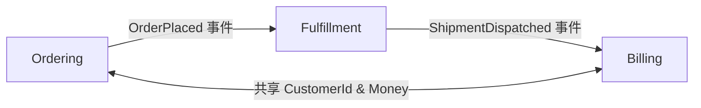

# CONTEXT.md 格式

## 結構

```md
# {Context 名稱}

{一到兩句話說明這個 context 是什麼，以及它存在的原因。}

## 通用語言

**{Identifier}（中文名稱）**：{一句話說明這個術語在這個 codebase 裡代表什麼。}
_避免使用_：收錄容易被誤用的英文別名、縮寫，以及同義但不精確的中文詞，但不收錄 identifier 括號內已標示的中文名稱、

**Purchase Order（訂單）**：客戶提供正式文件，回簽後交易正式成立。
_避免使用_：Purchase、transaction、採購、交易、PO

**Proforma Invoice（發票）**：客戶收到貨品後寄出的付款請求。
_避免使用_：Bill、payment request、帳單、付款單、PI

**Customer（客戶）**：下訂單的個人或組織。
_避免使用_：Client、buyer、account、買家、帳戶
```

## 規則

- **態度明確。** 同一概念有多個說法時，選最好的那個，其他列在 `_避免使用_:` 底下。
- **只回答「這個術語在這個 codebase 裡是什麼」。** 不寫狀態機、欄位規格、關聯基數、業務規則、限制條件。這些屬於 ADR 或 PRD。
- **只寫當前事實，不保留歷史脈絡。** 定義只描述術語現在的意義，不記錄演變過程（如「取代 X」、「原本稱為 Y」）。歷史背景與決策理由屬於 ADR。
- **只收錄這個 context 專屬的術語。** 通用的程式設計概念（timeout、error type、utility pattern）不屬於這裡。加術語前先問自己：這個概念是這個 context 獨有的，還是通用概念？只有前者才收錄。
- **有自然的分群時，用子標題分類。** 如果所有術語屬於同一個主題，直接列表即可。

## 單一 vs 多 context 專案

**單一 context（大多數專案）：** 一份放在 repo 根目錄的 `CONTEXT.md`。

**多個 context（含 monorepo）：** 在 repo 根目錄放一份 `CONTEXT-MAP.md`，CONTEXT.md 集中放在 `docs/contexts/`，列出各 context 的位置與彼此的關係：

````md
# Context 地圖

## Context 清單

- [Ordering](./docs/contexts/ordering.md)，接收並追蹤客戶訂單
- [Billing](./docs/contexts/billing.md)，產生發票並處理付款
- [Fulfillment](./docs/contexts/fulfillment.md)，管理倉儲揀貨與出貨

## 關係


````

Skill 會自動推斷應使用哪種結構：

- 若存在 `CONTEXT-MAP.md`，讀取它來找到各 context（路徑通常指向 `docs/contexts/`）
- 若只有根目錄的 `CONTEXT.md`，視為單一 context
- 若兩者都不存在，第一個術語確立時再建立根目錄的 `CONTEXT.md`

有多個 context 時，從當前話題推斷對應的 context。若無法確定，直接詢問。
