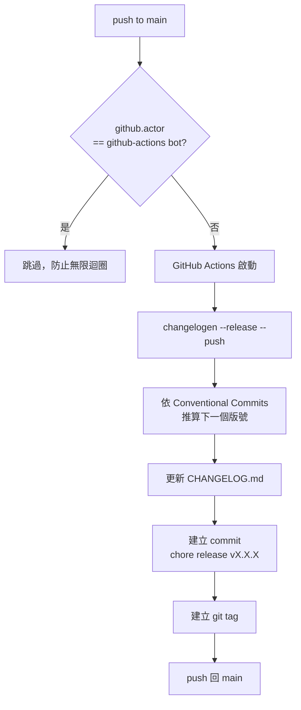
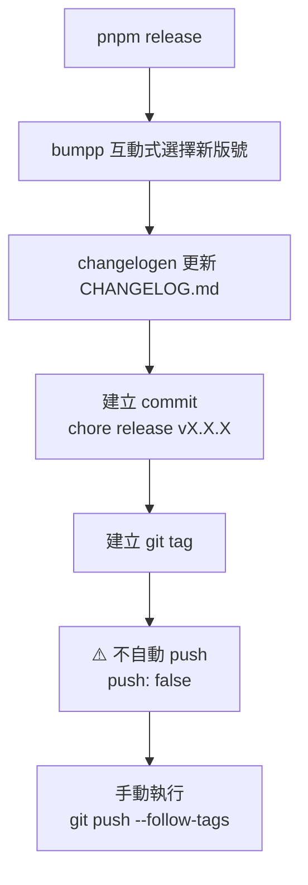

# SuperDSP Monorepo

SuperDSP 2.0

## 調整 Node.js / pnpm 版本

升版時需同步更新以下四處，確保 Volta 與 nvm 用戶行為一致：

| 檔案           | 欄位             | 範例            |
| -------------- | ---------------- | --------------- |
| `package.json` | `volta.node`     | `"24.15.0"`     |
| `package.json` | `volta.pnpm`     | `"11.1.2"`      |
| `package.json` | `packageManager` | `"pnpm@11.1.2"` |
| `.nvmrc`       | （整個檔案）     | `24.15.0`       |

`engines` 欄位為寬鬆下限，不需要同步精確版號。

### 快速指令

```bash
# Volta 用戶：pin 後自動寫入 package.json
volta pin node@24.15.0
volta pin pnpm@11.1.2

# 同步更新 packageManager 欄位
corepack use pnpm@11.1.2

# 更新 .nvmrc
echo "24.15.0" > .nvmrc
```

## 版本發布流程

版本管理使用 [changelogen](https://github.com/unjs/changelogen)（Changelog 產生 + 自動版號）與 [bumpp](https://github.com/antfu/bumpp)（互動式手動發版）。

### 自動發版（CI）

每次 push 到 `main` 後，`.github/workflows/release.yml` 自動執行：



> `fetch-depth: 0` 確保 changelogen 能讀取完整 git history 以計算版號。

### 手動發版（本機）

```bash
pnpm release
```

執行 `bumpp`（讀取 `bump.config.mjs`）：



### 版號規則

依 [Conventional Commits](https://www.conventionalcommits.org/) 自動推算：

| Commit 類型                  | 版號變化       |
| ---------------------------- | -------------- |
| `fix:`                       | patch（0.0.x） |
| `feat:`                      | minor（0.x.0） |
| `feat!:` / `BREAKING CHANGE` | major（x.0.0） |

### 相關檔案

| 檔案                            | 用途                 |
| ------------------------------- | -------------------- |
| `.github/workflows/release.yml` | CI 自動發版 workflow |
| `bump.config.mjs`               | bumpp 手動發版設定   |
| `CHANGELOG.md`                  | 自動產生的版本紀錄   |

## pnpm 設定位置（v11+）

pnpm v11 起，設定分離至不同檔案：

| 設定類型           | 位置                                  |
| ------------------ | ------------------------------------- |
| auth / registry    | `.npmrc`                              |
| 所有其他 pnpm 設定 | `pnpm-workspace.yaml`                 |
| build script 授權  | `pnpm-workspace.yaml` → `allowBuilds` |

> **注意**：`.npmrc` 中的非 auth 設定在 v11 會被忽略。
