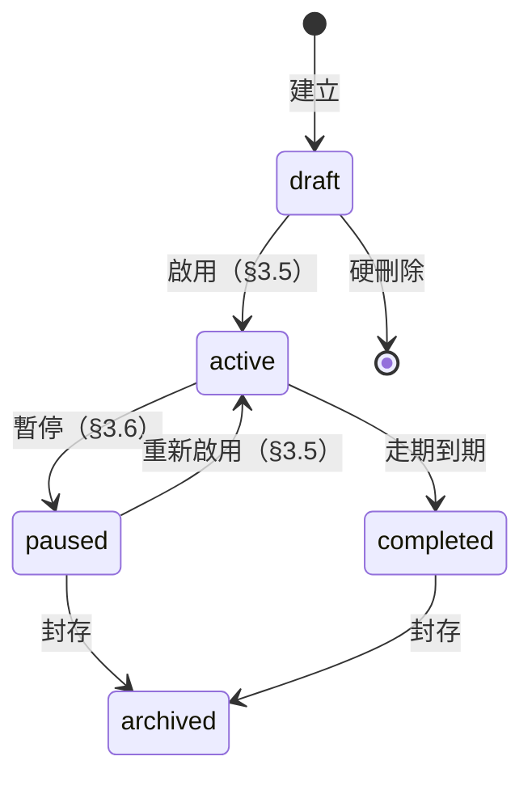

# SuperDSP — 廣告層級核心規格（Campaign / LI / 素材 / 追蹤碼）

> 最後更新：2026-06-06
> UAT 目標：2026/07/20，對象為 AOE 內部試用

---

## §0 名詞解釋

| 名詞           | 說明                                                      |
| -------------- | --------------------------------------------------------- |
| `OneAD`        | 公司名稱                                                  |
| `AOE`          | OneAD 的廣告操作人員                                      |
| `ODM`          | AOE 目前操作廣告的平台                                    |
| `SuperDSP 1.0` | 對外開放使用者自己操作廣告投放的平台                      |
| `SuperDSP 2.0` | **本規格定義的平台**，整合 `ODM` 和 `SuperDSP 1.0` 的平台 |

---

## §1 範圍與前提

### §1.1 階段目標

- `2026/07/20` 先做 UAT，提供給 `AOE` 試用，無外部用戶，目標是取代 ODM 系統。

### §1.2 範圍

- 系統登入頁面
- 廣告層級結構：**Campaign（廣告活動）→ 投放項目 (Line Item) → 素材包 (Creative Pack)**；上方可選擇性掛載**活動群組（Group）**作為分類容器
- 追蹤碼模版：**OnePixel / CCT / 第三方量測**的 CRUD、欄位、刪除規則、與 LI 及素材包的綁定規則

---

## §2 架構總覽

### §2.1 層級樹

```
[活動群組（Group），選擇性容器，可省略]
  └─ Campaign（廣告活動）
       └─ Line Item / LI（投放項目）
            └─ 素材包（Creative Pack，多對多綁定）
                 └─ 廣告素材（多筆，唯讀）
```

### §2.2 各層職責

| 層級              | 預算                         | 走期                                | 自身重點                                     |
| ----------------- | ---------------------------- | ----------------------------------- | -------------------------------------------- |
| 活動群組（Group） | 無（底下 Campaign 加總聚合） | 無（底下 Campaign 取聯集聚合）      | 純分類容器，選擇性使用                       |
| Campaign          | 自設總預算（LI 加總上限）    | 自設走期（LI 建立／編輯的邊界約束） | 行銷目標、預算上限、走期邊界；**無投放狀態** |
| LI                | 自設總預算 + 每日預算表      | 自設走期（需在 Campaign 走期內）    | **唯一投放開關**；持完整狀態機與素材包綁定   |
| 素材包            | —                            | —                                   | 廣告素材組合（唯讀）                         |
| 廣告素材          | —                            | —                                   | 廣告素材，可能是 Banner 或是 Video           |

---

## §3 狀態機（LI 專屬）

### §3.1 Campaign 無投放狀態

Campaign 的職責是預算上限與走期邊界，**不是投放開關**，故沒有可切換的投放狀態，也不對底下 LI 產生任何遮蔽效果。

Campaign 向使用者呈現三個衍生資訊（系統自動計算，使用者不可手動切換），按優先序：

1. **無投放項目**：非 `archived` LI 數量 = 0（含無 LI、底下 LI 全部封存）
2. **N / M 投放中**：有任一非 `archived` LI 尚未 `completed`（N = `active` LI 數，M = 非 `archived` LI 總數）
3. **已完成**：底下所有非 `archived` LI 皆為 `completed`，或為（`paused` 且 `endDate < 今天`）

> Campaign 走期結束後**不自動凍結底下 LI**，走期只是建立／編輯 LI 時的邊界約束，不觸發任何自動收斂或封存機制。

### §3.2 狀態定義（LI）

| 狀態        | 意義                                                 | 是否投放 |
| ----------- | ---------------------------------------------------- | -------- |
| `draft`     | 草稿，尚未啟用                                       | ❌       |
| `active`    | 啟用中                                               | ✅       |
| `paused`    | 使用者主動暫停                                       | ❌       |
| `completed` | 走期到期，系統自動收斂的終態                         | ❌       |
| `archived`  | 使用者手動封存，列表預設隱藏；**不可還原，只能複製** | ❌       |

### §3.3 狀態轉換規則（LI）



- `draft`：只能**硬刪除**（不可逆，須確認 dialog）或啟用，不可封存
- `active`：不可封存或刪除
- `completed` 為功能終態：
  - 不可啟用、不可修改走期／預算／素材包綁定
  - 可封存以整理檢視
- `archived`：不可還原，只能複製（見 §3.3.1）

#### §3.3.1 封存與複製

**封存（→ `archived`）**

- 手動觸發，條件：LI 狀態為 `paused` 或 `completed`
- 封存後列表預設隱藏，可透過篩選 / tab 查看
- **不可還原**：封存後只能透過「複製」建立新 LI

**複製（`archived` →）**

- 手動觸發，複製 LI 自身欄位及素材包綁定（見 §8.3.2）
- 新 LI 狀態 = `draft`，走期照搬
  - 若走期已過期，啟用前強制引導使用者更新走期

### §3.4 completed 的觸發

- **走期到期自動 completed**：LI `endDate` 過期後，系統自動將 `active` LI 設為 `completed` 並停止投放
- `draft` LI 走期到期後**維持 `draft`**，不自動 `completed`
- `paused` LI 走期到期後**維持 `paused`**，不自動 `completed`；走期仍可修改，延長後（`endDate >= 今天`）可重新啟用
- **預算花完不等於 completed**：仍在走期內加預算即可續跑
- `completed` **為功能終態**：不可啟用、不可修改，需重新投放請建立新 LI 或複製（見 §7.2.3、§8.3.2）

### §3.5 啟用 LI 條件

啟用 LI（`draft` / `paused` → `active`），須同時通過：

> 走期已過期（`endDate < 今天`）的 `paused` LI，「重新啟用」按鈕為 disabled，hover tooltip 說明「走期已到期，請先更新走期後再啟用」；StatusBadge 維持 `paused` 並附 icon hint，hover 同上。

1. 自身狀態為 `draft` 或 `paused`
2. **Campaign 邊界檢查**：所屬 Campaign 存在且未封存、LI 走期完全落在 Campaign 走期內、LI 預算加總 ≤ Campaign 預算上限
3. 預算 > 0
4. **至少一個啟用中（active）且審核通過的素材包已綁定**
5. 走期 `startDate` / `endDate` 皆已填，且 `endDate ≥ startDate`，且 `endDate ≥ 今天`
6. **若為 AOE**，`產品線` 不為空

> Campaign 無投放狀態，不要求「父層 Campaign 已啟用」；只需 Campaign 存在且未封存。

### §3.6 素材停用聯動

- 當 LI 所有綁定的素材包皆已停用或審核不通過 → 該 LI 自動從 `active` 降為 `paused`，並跳通知告知原因
- 素材包開關**不受父層 LI 狀態限制**：即使 LI 為 `draft` 或 `paused`，仍可在 LI 詳情頁操作廣告素材包的開關（避免「LI 無法啟用 → 素材無法開啟 → 死結」）

### §3.7 批次操作

- 支援批次暫停、批次啟用（LI 巢狀列表）
- **部分成功**：能啟用的照啟，不能啟用的逐條列出失敗原因，不會因個別失敗而整批 rollback

---

## §4 預算規則

### §4.1 結構：聚合 + 上限混合

| 層級              | 預算模型                                                          |
| ----------------- | ----------------------------------------------------------------- |
| 活動群組（Group） | Bottom-up 聚合：= Σ(底下 Campaign budget)，無獨立欄位；選擇性存在 |
| Campaign          | 自設總預算 = 底下 LI 加總的上限                                   |
| LI                | 自設總預算 + 每日預算表                                           |

### §4.2 預算驗證

- **LI 加總 vs Campaign 上限**：任何時候（編輯 / 啟用）只要 LI budget 加總超過 Campaign budget，直接擋住、不給存
- **Campaign 改總預算時，底下 LI 不自動重分配**：只改變上限，分配權留在 LI 層。改完若 LI 加總超過新上限 → 直接擋
- **`archived` LI 不計入預算加總**，`draft`、`paused`、`completed` LI 皆計入
- **`archived` LI 花費計入 Campaign 花費加總**：花費為已實際發生的成本，封存後仍反映於 Campaign 進度

### §4.3 每日預算表（LI 層）

- **總預算 = 可分配預算池**，每日預算是它的分配
- **允許暫時沒分配完**：每日預算加總 **≤** 總預算（差額視為「待分配池」）
- 每日預算有三種狀態

| 預算值         | 語意               | 「均分預算」是否會動它 |
| -------------- | ------------------ | ---------------------- |
| `null`（空白） | 待分配             | ✅ 會被填入            |
| `0`            | 刻意設 0，當天不投 | ❌ 跳過                |
| 正整數         | 已排定金額         | ❌ 保留                |

#### §4.3.1 時間軸鎖定規則

| 區間                 | 規則                                                      |
| -------------------- | --------------------------------------------------------- |
| **過去日**（< 今天） | 完全鎖定，不可改                                          |
| **今日**             | 可調，但**下限 = 今日已花費**（不能調到比今天已花的還低） |
| **未來日**           | 完全可調                                                  |

#### §4.3.2 每日預算動作

- **建立 LI**：總預算平均攤到走期每一天，餘數給最後一天

- **修改 LI 總預算**：跳出詢問框，差額如何處理（二選一）：
  - **是，自動分配**：差額分配邏輯與均分預算相同，**跳過 `0` 與正整數的日期**，只分配到 `null` 的日期（今日為 `null` 時保底 ≥ `todaySpent`）
  - **否，自己處理**：差額加入可分配預算池，每日表不動

- **重設每日預算**：使用者明確勾選要重設的日期
  - 勾選日期的預算替換為實際花費（過去日 / 今日）或清空（未來日），差額計入可分配預算池
  - 不自動清空所有未來日（避免抹掉刻意設為 `0` 的日期）

- **均分預算**：

  分配預算池 = 總預算 − 過去日已花費加總 − 已排定日金額加總（含今日正整數值）

  | 日期類型      | 參與分配 | 備註                    |
  | ------------- | -------- | ----------------------- |
  | 預算為 `null` | ✅       | 今日保底 ≥ `todaySpent` |
  | 預算為 `0`    | ❌       | 刻意不投，跳過          |
  | 預算為正整數  | ❌       | 已排定，保留            |
  | 過去日        | ❌       | 已鎖定                  |

  分配預算池平均分配到所有參與日。

> 「重設每日預算」與「均分預算」按鈕僅顯示於 LI 詳情頁，新建頁不顯示。

---

## §5 走期規則

### §5.1 結構（與預算對稱）

| 層級              | 走期模型                                   |
| ----------------- | ------------------------------------------ |
| 活動群組（Group） | 聚合：所有 Campaign 取**聯集**；選擇性存在 |
| Campaign          | 自設（LI 建立／編輯時的邊界約束）          |
| LI                | 自設，但**必須在 Campaign 走期內**         |

> Campaign 走期**不自動收斂**：走期結束後底下 LI 仍可各自操作，不觸發凍結或封存。

### §5.2 Campaign 改走期

若改 Campaign 走期會使**現有任一非 `archived` LI 超出範圍**（頭或尾超界），**直接擋住、不給改**。

### §5.3 LI 改走期

`endDate` 最早只能設定為今天，不可回推到過去日，走期須完全落在 Campaign 走期內。

走期變更存檔時，**彈出詢問框**（二選一）：

| 選項                   | 走期                                   | 每日預算表                                                        |
| ---------------------- | -------------------------------------- | ----------------------------------------------------------------- |
| **稍後再分配**（預設） | 套用走期變更                           | 延長→新增日預設 `null`（待分配），縮短→砍掉日退回待分配池，不跳轉 |
| **去調整每日預算**     | 套用走期變更                           | 同上，並跳轉至每日預算調整 UI                                     |
| **取消**               | 放棄此次走期變更，走期與每日預算都不動 | —                                                                 |

> 建立 LI 時不跳此彈窗，直接平均攤到走期每一天（見 §4.3.2）。

---

## §6 活動群組（Group）

活動群組是選擇性的 Campaign 分類容器，沒有自身的預算、走期與狀態。使用者可自行決定是否對廣告活動分組，未分組的 Campaign 仍可獨立存在。

### §6.1 建立與管理

活動群組無獨立管理頁面，透過兩個入口操作：

1. **Campaign 建立 / 編輯表單**：「活動群組」欄位為下拉選單，可直接輸入新名稱即時建立 Group，選填
2. **Campaign 列表 dropdown menu**：「移至群組」操作，可指派至現有群組或建立新群組，「從群組移除」可解除關聯

### §6.2 欄位

| 欄位          | 來源     | 說明                                 |
| ------------- | -------- | ------------------------------------ |
| id            | 系統產生 |                                      |
| 名稱          | 使用者   | 建立或修改時輸入                     |
| 預算          | 自動聚合 | 底下所有 Campaign 預算加總（顯示用） |
| 走期          | 自動聚合 | 底下所有 Campaign 走期聯集（顯示用） |
| Campaign 數量 | 自動計算 |                                      |

---

## §7 廣告活動（Campaign）

### §7.1 列表頁（/campaigns）

平鋪列表，活動群組以欄位呈現，可依群組篩選。

欄位表：

| 欄位         | 說明                                                              |
| ------------ | ----------------------------------------------------------------- |
| id           |                                                                   |
| 名稱         | 可點擊，進入 Campaign 詳情頁                                      |
| 活動群組     | 所屬 Group 名稱，無 Group 時顯示 `—`                              |
| 行銷目標     | Brand Building / Push Conversion / Drive Traffic / Others         |
| 狀態（衍生） | 無投放項目 / N / M 投放中 / 已完成（見 §3.1），唯讀，不可手動切換 |
| 走期         | Campaign 自設走期                                                 |
| 預算         | Campaign 總預算                                                   |
| 花費         | Campaign 花費加總（含 `archived` LI 花費）                        |
| 進度         | 花費 / 預算，進度條呈現                                           |
| 投放項目數量 | 底下 LI 個數                                                      |
| 操作         | 複製、封存 / 還原（依封存狀態）、移至群組                         |

排序：預設建立時間倒序（ID 倒序），不可自訂排序。

篩選／搜尋：狀態篩選（全部 / 進行中 / 已完成 / 已封存）+ 活動群組篩選 + 搜尋框（廣告活動名稱、廣告活動 ID）。

> 「進行中」= 衍生狀態為「無投放項目」或「N/M 投放中」的 Campaign（非 completed、非 archived）。

批次操作：**無**（投放開關只在 LI）。

#### §7.1.1 Campaign 封存與還原

**封存**

- **封存條件**：底下所有 LI 皆非 `active`（含無 LI 的 Campaign）
- **手動觸發**：使用者主動點「封存」；條件不滿足時按鈕 disabled 並說明原因
- 封存後列表預設隱藏，可透過「已封存」篩選 / tab 查看
- **封存後詳情頁全部只讀**，所有操作 disabled，還原後才恢復可操作狀態

**還原**

- 手動操作，入口在 **Campaign 列表操作欄**（已封存的 Campaign 顯示「還原」取代「封存」）
- 還原後底下 LI 維持各自原狀態，使用者自行決定是否重新啟用底下 LI

### §7.2 詳情 / 新建

> 標注 `[建立後不可改]` 的欄位一旦建立即不可修改。

#### §7.2.1 行銷目標

根據不同行銷目標，篩選出可以選擇的廣告品類，`Others` 全開，主要是供 `AOE` 使用。建立後不可修改。

| 欄位              | 說明              |
| ----------------- | ----------------- |
| `Brand Building`  | 同 `SuperDSP 1.0` |
| `Push Conversion` | 同 `SuperDSP 1.0` |
| `Drive Traffic`   | 同 `SuperDSP 1.0` |
| `Others`          | 所有品類全開      |

#### §7.2.2 欄位

| 欄位         | 來源     | 說明                                          | 必填 |
| ------------ | -------- | --------------------------------------------- | ---- |
| id           | 系統產生 |                                               |      |
| 名稱         | 使用者   |                                               | ✅   |
| 行銷目標     | 使用者   | `[建立後不可改]`                              | ✅   |
| 預算         | 使用者   |                                               | ✅   |
| 走期         | 使用者   | 結束日期必須 >= 起始日期                      | ✅   |
| 活動群組     | 使用者   | 下拉選單，選填，可輸入新名稱即時建立          |      |
| 投放項目數量 | 自動計算 | 底下 LI 數量                                  |      |
| 狀態（衍生） | 自動計算 | 無投放項目 / N / M 投放中 / 已完成（見 §3.1） |      |

> Campaign **無「投放狀態」欄位**，不持久化投放控制狀態。

#### §7.2.3 複製

- 複製 Campaign 連同底下**所有 LI 一起複製**
- 新 Campaign + 新 LI 皆拿到新 id；花費與成效歸零
- 複製出的 LI 狀態一律為 `draft`，素材包綁定一併帶過去，**（LI × 素材包）的啟用狀態照搬來源**
- **追蹤碼設定不複製**（CCT / 第三方量測 / OnePixel），新 LI 從空白開始設定
- 行銷目標、預算、走期、分組等設定沿用來源值，使用者可自行修改
- 點擊「複製」先跳確認 dialog「確定要複製「原名稱」嗎？」，複製成功後重新整理列表，無 toast 通知

---

## §8 投放項目（LI）

主欄位跟 `ODM` 一致，部分 UI 採 `SuperDSP 1.0 模式`。

### §8.1 全域列表（/line-items）

跨 Group / Campaign 的平鋪列表，僅供瀏覽，點擊列進入 LI 詳情頁，無任何 inline 操作。

欄位表：

| 欄位     | 說明                                 |
| -------- | ------------------------------------ |
| 名稱     | 可點擊，進入 LI 詳情頁               |
| 活動群組 | 所屬 Group 名稱，無 Group 時顯示 `—` |
| 廣告活動 | 所屬 Campaign 名稱                   |
| 廣告品類 | 該 LI 的廣告品類                     |
| 廣告格式 | 該 LI 的廣告格式                     |
| 計價方式 | 出價類型（CPM / CPC 等）             |
| 狀態     | StatusBadge                          |
| 預算     | LI 總預算                            |

排序：預設建立時間倒序（ID 倒序），不可自訂排序。

篩選／搜尋：狀態篩選（all / active / paused / draft / completed / archived）+ 搜尋框（LI 名稱、LI ID、所屬廣告活動名稱、廣告活動 ID、所屬活動群組名稱、活動群組 ID）。

無批次操作。

### §8.2 巢狀列表（Campaign 詳情頁內）

只顯示該 Campaign 底下的 LI，不含「活動群組」與「廣告活動」欄。支援完整操作。

欄位表：

| 欄位     | 說明                                  |
| -------- | ------------------------------------- |
| 名稱     | 可點擊，進入 LI 詳情頁                |
| 廣告品類 | 該 LI 的廣告品類                      |
| 廣告格式 | 該 LI 的廣告格式                      |
| 計價方式 | 出價類型（CPM / CPC 等）              |
| 狀態     | StatusBadge，可 inline 切換           |
| 預算     | LI 總預算                             |
| 操作     | 複製、封存／刪除（依狀態，見 §8.2.1） |

排序：預設建立時間倒序（ID 倒序），不可自訂排序。

篩選／搜尋：狀態篩選（all / active / paused / draft / completed / archived）+ 搜尋框（LI 名稱、LI ID）。

批次操作：批次暫停、批次啟用。

#### §8.2.1 LI 刪除 / 封存 / 複製規則

| 狀態        | 可執行操作 | 行為                                                              |
| ----------- | ---------- | ----------------------------------------------------------------- |
| `draft`     | 硬刪除     | 彈出確認 dialog「確定刪除此草稿？此操作無法還原」，確認後永久刪除 |
| `active`    | —          | 不可刪除或封存                                                    |
| `paused`    | 封存       | 列表隱藏，可透過篩選 / tab 查看                                   |
| `completed` | 封存       | 同上                                                              |
| `archived`  | 複製       | 複製建立新 `draft` LI（見 §8.3.2）                                |

### §8.3 詳情 / 新建

| 欄位                | 來源     | 說明                                                                    | 必填 | AOE 專用 |
| ------------------- | -------- | ----------------------------------------------------------------------- | ---- | -------- |
| id                  | 系統產生 |                                                                         |      |          |
| 名稱                | 使用者   |                                                                         | ✅   |          |
| 預算                | 使用者   |                                                                         | ✅   |          |
| 代理商              | 使用者   | 只在 `AOE` 操作時顯示                                                   |      | 🔒       |
| 廣告品類            | 使用者   |                                                                         | ✅   |          |
| 廣告格式            | 使用者   | 受 Campaign `行銷目標` 與 LI `廣告品類` 約束                            | ✅   |          |
| 計價方式            | 使用者   |                                                                         | ✅   |          |
| 投放優先層級        | 使用者   | 只開給 `AOE` 操作；參考 `ODM`                                           | ✅   | 🔒       |
| 投放節奏            | 使用者   | `ASAP` \| `Hourly Even`                                                 | ✅   |          |
| 走期                | 使用者   | 結束日期必須 >= 起始日期，須在 Campaign 走期內                          | ✅   |          |
| 狀態                | 系統產生 | 建立後必為 `draft`                                                      |      |          |
| 產品線              | 使用者   | 只在 `AOE` 操作時顯示，與 `廣告格式` 解耦，`active` 前都可隨意修改      |      | 🔒       |
| 負責業務            | 使用者   | 只在 `AOE` 操作時顯示                                                   | ✅   | 🔒       |
| 投放時段            | 使用者   | 星期 x 時段，同 DV 360                                                  | ✅   |          |
| 便宜流量，原 pacing | 使用者   | 是否啟用，啟用需填多少預算比例                                          | ✅   |          |
| CCT                 | 使用者   | 多選，LI 設**預設值**，帶入每個（LI × 素材包）、可逐包覆寫（見 §8.3.1） |      |          |
| 第三方量測          | 使用者   | 單選，LI 設**預設值**，帶入每個（LI × 素材包）、可逐包覆寫（見 §8.3.1） |      |          |
| OnePixel            | 使用者   | 單選，LI 設**預設值**，帶入每個（LI × 素材包）、可逐包覆寫（見 §8.3.1） |      |          |
| 投放維度            | 使用者   | **選項過多**，參考 `SuperDSP 1.0`                                       | ✅   |          |

#### §8.3.1 調整追蹤碼設定

三種追蹤碼共用相同的儲存與設定邏輯：

| 追蹤碼類型 | 選擇方式 |
| ---------- | -------- |
| OnePixel   | 單選     |
| CCT        | 多選     |
| 第三方量測 | 單選     |

**儲存位置**：記錄在（LI × 素材包），同一素材包在不同 LI 可各自獨立設定。

**預設值**：LI 表單欄位為預設值，綁定新素材包時自動帶入。

**設定入口（兩種）**：

1. **逐包編輯**：LI 詳情頁素材包列 ⋮ →「編輯追蹤碼」，只影響該（LI × 素材包）
2. **改 LI 預設值 → 批次套用**：修改後存檔，彈出 dialog 讓使用者勾選要覆蓋哪些已綁素材包
   - 未勾的維持原設定
   - 僅在編輯既有 LI 存檔時觸發，新建 LI 不觸發
   - LI 無任何綁定素材包則跳過

#### §8.3.2 複製 LI

- 複製 LI 自身欄位，**素材包綁定一併帶過去**，**（LI × 素材包）的啟用狀態照搬來源**
- **追蹤碼設定不複製**（CCT / 第三方量測 / OnePixel），新 LI 從空白開始設定
- 新 LI 狀態 = `draft`，走期日期照搬
  - 若走期已過期，啟用前強制引導使用者更新走期
- 點擊「複製」先跳確認 dialog，複製成功後重新整理列表，無 toast 通知

---

## §9 廣告素材

### §9.1 列表頁（/creatives）

顯示所有**已被至少一個 LI 綁定**的素材包（完整素材目錄另有獨立頁面）。

欄位表：

| 欄位         | 說明                                                                 |
| ------------ | -------------------------------------------------------------------- |
| 名稱         | 素材包名稱                                                           |
| 廣告格式     | 素材包的廣告格式                                                     |
| 素材預覽     | Studio，並排顯示包內所有廣告素材縮圖                                 |
| 素材時長     | Studio，逐一列出包內每支素材時長                                     |
| 綁定投放項目 | 綁定的 LI 名稱列表，附顯示「幾個啟用 / 幾個關閉」                    |
| 開關         | 點擊跳出 LI 選擇框（見 §9.2.3），讓使用者選擇要對哪些 LI 套用開 / 關 |
| 曝光數       | 加總成效                                                             |
| 點擊數       | 加總成效                                                             |
| CTR          | 點擊數 / 曝光數                                                      |
| 花費         | 加總成效                                                             |

排序：預設建立時間倒序（ID 倒序），不可自訂排序。

篩選／搜尋：搜尋框（素材包名稱、素材包 ID、所屬 LI 名稱、LI ID）。

無批次操作。

### §9.2 詳情

素材包由外部系統匯入，本平台無新建素材包 UI；此頁供查閱詳情並檢視包內廣告素材。

> 標注 `[建立後不可改]` 的欄位一旦建立即不可修改。

#### §9.2.1 素材包欄位

| 欄位     | 來源     | 說明                                                                         |
| -------- | -------- | ---------------------------------------------------------------------------- |
| id       | 系統產生 |                                                                              |
| 名稱     | 系統產生 |                                                                              |
| 審核狀態 | 系統產生 | 外部平台帶入，包內所有素材皆通過才為已審核，選擇素材包時僅顯示已審核通過的包 |
| 廣告品類 | 系統產生 | 用於綁定 LI 時篩選，需與 LI 廣告品類相符                                     |
| 廣告格式 | 系統產生 | 用於綁定 LI 時精確比對，需與 LI 廣告格式相符 `[建立後不可改]`                |

> 啟用狀態（active / paused）為 **per（LI × 素材包）**，在 LI 詳情頁切換（見 §9.2.3）；非素材包的全域欄位。
> CCT / 第三方量測 / OnePixel 設定記在（LI × 素材包），在 LI 詳情頁操作（見 §8.3.1）。

#### §9.2.2 包內廣告素材（子列表，唯讀）

每個素材包包含一至多支廣告素材，由 Studio 帶入，本平台不提供新增或刪除。

| 欄位     | 來源   | 說明                              |
| -------- | ------ | --------------------------------- |
| 名稱     | Studio |                                   |
| 素材類型 | Studio | banner / video 等，用於辨識素材   |
| 素材預覽 | Studio |                                   |
| 素材時長 | Studio | 無時長的素材（如 banner）顯示 `—` |

#### §9.2.3 素材包開關

啟用狀態為 **per（LI × 素材包）**：同一素材包在不同 LI 可各自開關。

- **從 LI 詳情頁**：可對個別綁定的素材包做開關，直接影響該（LI × 素材包）
- **從素材列表**：點擊開關後，跳出所有綁定該素材包的 LI 選擇框，讓使用者選擇要套用哪些 LI
  - **關閉操作**：「只有此素材包的 LI」在 dialog 中**顯示但 disabled**，並附說明「此 LI 只有這個素材包，無法從這裡關閉」
  - **開啟操作**：此限制不適用，所有綁定的 LI 皆可正常勾選

---

## §10 追蹤碼模版

### §10.1 設計原則

- 三種實體：**OnePixel**、**CCT**、**第三方量測**
- 只有兩種狀態：**存在**與**已刪除**
- **追蹤碼的刪除，只影響「量測」，不影響「投放」**：刪除追蹤碼後廣告照投，但可能造成成效數據缺漏
- CCT / 第三方量測 / OnePixel 在 LI 設為預設值，帶入（LI × 素材包）（見 §8.3.1）
- 刪除時，若有 LI 或素材包仍在綁定，系統顯示「共有 N 個綁定將被解除」警告，確認後**自動移除綁定**

### §10.2 OnePixel

OnePixel 是 OneAD 自家的追蹤碼模板，部署於廣告主網站，用於收集第一方事件數據。

#### §10.2.1 欄位

參考 `SuperDSP 1.0`

### §10.3 CCT

CCT Tracker（Cross-Channel Tracker）負責在指定廣告事件發生時，傳送轉換訊號給外部廣告渠道（LINE、Google Ads 等）。

#### §10.3.1 欄位

參考 `SuperDSP 1.0` 與 `ODM`

### §10.4 第三方量測

提供第三方量測廠商的 tracking tag，在 LI 設為預設值帶入（LI × 素材包）（見 §8.3.1）。

#### §10.4.1 欄位

| 欄位                             | 說明                     |
| -------------------------------- | ------------------------ |
| DoubleClick Campaign Manager URL | DCM 1×1 Pixel 網址       |
| Nielsen URL                      | Nielsen 1×1 Pixel 網址   |
| Integral Ad Science URL          | IAS JavaScript Tag 網址  |
| DoubleVerify URL                 | DoubleVerify JS Tag 網址 |

- 四個欄位至少填一個
- 所有填入的 URL 必須為 HTTPS
